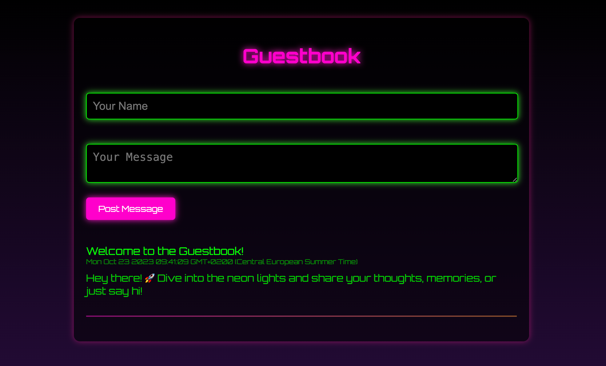

# Guestbook App

Simple retro guestbook app with steps how to deploy it to production server with automatic TLS (HTTPS).



## Development

```shell
npm run dev
```

## Production Server Installation

Create a new server with a provider such as:
- Linode/Akamai
- Digital Ocean
- Hetzner
- etc.

What do we need to install?
- Caddy (web server with automatic TLS)
- Node.js (JavaScript runtime)
- Git


### Caddy

https://caddyserver.com/

#### Install

- https://caddyserver.com/docs/install#debian-ubuntu-raspbian

#### Configure

Edit `/etc/caddy/Caddyfile`:

```caddy
example.com {
    tls email@example.com

    reverse_proxy localhost:3000
}
```

__Note:__ Replace `example.com` with your actual domain name and `email@example.com` with your email address. Your email address will be used as a contact for the certificate provider, Let's Encrypt (https://letsencrypt.org/).

Don't forget to restart Caddy after editing the config file:

```shell
systemctl restart caddy
```
### Node.js

Use NodeSource to install Node.js.
- https://github.com/nodesource/distributions#installation-instructions

After test if it works:

```shell
node --version
```

### Install the application

```shell
cd /opt
git clone https://github.com/rostislavjadavan/guestbook-app
cd guestbook-app
npm install
```

__Note:__ Don't forget to create `.env` file with database credentials.

#### PM2 process manager

For process management we will use PM2 (https://pm2.keymetrics.io/docs/usage/quick-start/).

To make application persistent we need to:

```shell
# Generate startup script
npm run pm2:init

# Start the application
npm run pm2:start

# Save the process list
npm run pm2:save
```

More information: https://pm2.keymetrics.io/docs/usage/startup/

## Database

Create new database at https://neon.tech/

```sql
CREATE TABLE messages (
    id SERIAL PRIMARY KEY,
    name VARCHAR(255) NOT NULL,
    message TEXT NOT NULL,
    timestamp TIMESTAMP DEFAULT current_timestamp
);
```
